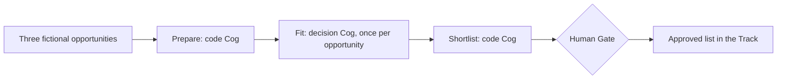

# Opportunity Shortlist: learn one Cog, then an Op

Find out which of three fictional opportunities an example company should investigate.
Run one worker first, then connect it to two other workers and make a human decision.

**The default walkthrough is offline.** All opportunities and company profiles are
fictional. The answers are hand-authored synthetic fixtures, not recorded model
responses and not calibrated probabilities. No model, account, key or network call
is needed after environment installation. The real decision-Cog machinery still
validates the answers and applies the policy. [Optional live inference](docs/live.md)
uses a separately admitted provider and can incur charges.

## Start in five commands

Use the public [builder workspace setup](../../docs/getting-started.md) to obtain
the manifest-listed sibling repositories. From that workspace, with Git,
Python 3.11+ and Pixi installed:

```sh
cd cog-op-builder/examples/opportunity-shortlist
pixi install --locked
pixi run setup
pixi run single
pixi run start
```

The single Cog recommends **pursue** for `OPP-001`, with score **0.88**.
The Op then assesses all three opportunities and **pauses for you**:

| Opportunity | Recommendation | Score |
|---|---|---:|
| OPP-001: Community data dashboard | pursue | 0.88 |
| OPP-002: Data portal with specialist security audit | review | 0.55 |
| OPP-003: Replace a pedestrian bridge | pass | 0.05 |

Read the pending review path printed by the command, then make your own choice:

```sh
pixi run decide -- --approve OPP-001 --reject-rest --by learner
pixi run status
```

The final approved list contains `OPP-001`. Approval means “investigate this
fictional opportunity”; nothing is downloaded, sent, submitted or written to an
external system. `--by` records the identity you supply, not authenticated identity.

Use `pixi run decide -- --reject-all --by learner` if you want none of them.
The helper never approves on your behalf or silently rejects unmentioned choices.
A human may choose a `review` recommendation instead of the highest-ranked one.

## What you are learning

A **Cog** is one bounded worker with declared inputs and outputs. An **Op**
connects workers, passes their results along, and records what happened in a
**Track**. A **Gate** decides whether the workflow may proceed. This example has
ordinary checks between steps and a human Gate on the shortlist.



| Folder | Worker or workflow | Author-owned work |
|---|---|---|
| `prepare/` | Code Cog: validate and preserve inputs | `src/task_logic.py`, schemas |
| `fit/` | Decision Cog: two typed judgments, then explicit policy | `context/questions.json`, `src/task_logic.py`, schemas |
| `shortlist/` | Code Cog: rank results and propose choices | `src/task_logic.py`, schemas |
| `op/` | Offline Op using synthetic fixtures | `op.yaml` |
| `op-live/` | Same workflow using the admitted live provider | `op.yaml` |
| `demo.py` | Learning client: readable output and decision-file creation | Invokes declared entry points; does not schedule the steps |

The `src/` machinery in each package was generated by the manifest-listed
Cog Smith. Shared runtime files are unchanged and checked by Smith. Package
folder names are kept short so the data flow is easy to follow; each folder
still contains a complete, independently checkable package.

## Choose your next step

- [Walkthrough](docs/walkthrough.md): inspect inputs, results, policy and the Op.
- [Exercises](docs/exercises.md): six core exercises and one optional building exercise.
- [Answers](docs/answers.md): expected observations and an optional Cog implementation.
- [Facilitator guide](docs/facilitator.md): a 15-minute demo and a 45-minute workshop.
- [Live mode](docs/live.md): use the same Cog and Op with a real model.
- [Implementation and verification](docs/implementation.md): interfaces, fixture provenance and checks.

## Verification

```sh
pixi run check
pixi run test
```

`check` verifies all three Cogs and both Ops with Smith and runs their own test
suites. `test` exercises the actual offline CLI and shared-runtime pause/resume,
rejection, altered evidence, alternate profile, and failure paths. Neither calls a
provider. Suite verification also runs these checks.

Environment setup uses the committed locks on macOS Apple Silicon and Linux
x86-64. It needs package-download access. Source, fictional fixtures and guides
are all inside this public repository; no another checkout checkout is required.

Local run artifacts, decision inputs, binding activation and environments are
ignored. Start a new run for a changed input; `resume` continues an existing run.
For the raw runtime, a normal human pause is exit **3**. The learning helper prints
the paused state and returns **0**, so it is understandable as an expected next step.

## License

Apache-2.0, under this repository's [license](../../LICENSE). Generated packages
retain Cog Smith's license and attribution files. This is an educational example,
not a qualification of model accuracy or a government-opportunity screening service.
